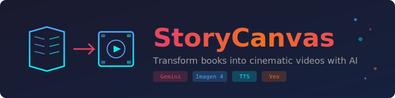

<p align="center">
  
</p>

<p align="center">
  <strong>Transform books into cinematic videos with AI</strong>
</p>

<p align="center">
  <a href="https://www.npmjs.com/package/storycanvas"></a>
  <a href="https://www.npmjs.com/package/storycanvas"></a>
  <a href="https://github.com/sunil-dhaka/storycanvas/blob/main/LICENSE"></a>
  <a href="https://nodejs.org"></a>
</p>

<p align="center">
  <a href="#installation">Installation</a> &bull;
  <a href="#quick-start">Quick Start</a> &bull;
  <a href="#features">Features</a> &bull;
  <a href="#commands">Commands</a> &bull;
  <a href="#configuration">Configuration</a>
</p>

---

StoryCanvas is an interactive CLI that converts books and text into illustrated videos with AI-generated imagery, professional narration, and background music. Powered by Google's Gemini ecosystem.

```
  ____  _                     ____
 / ___|| |_ ___  _ __ _   _  / ___|__ _ _ ____   ____ _ ___
 \___ \| __/ _ \| '__| | | || |   / _` | '_ \ \ / / _` / __|
  ___) | || (_) | |  | |_| || |__| (_| | | | \ V / (_| \__ \
 |____/ \__\___/|_|   \__, | \____\__,_|_| |_|\_/ \__,_|___/
                      |___/
```

## Features

| Feature | Description |
|---------|-------------|
| **Multi-Format Input** | TXT, PDF, EPUB, Markdown files |
| **Project Gutenberg** | Search and download 70,000+ classic books |
| **AI Illustrations** | Generate character & scene images with Imagen 4 |
| **Cohesive Narration** | TTS with 30+ voices, flows like an audiobook |
| **Synced Video** | Each image displays while its narration plays |
| **Background Music** | Mix royalty-free music tracks |
| **YouTube Ready** | Auto-generate titles, descriptions, tags |

## Installation

```bash
npm install -g storycanvas
```

Or run directly:

```bash
npx storycanvas
```

### Requirements

- **Node.js 22+**
- **Google Gemini API Key** - [Get one free](https://aistudio.google.com/app/apikey)

## Quick Start

### 1. Setup (one-time)

```bash
storycanvas onboard
```

The wizard will configure your API key, select models, and set output directories.

### 2. Create a video

```bash
# From Project Gutenberg (The Yellow Wallpaper)
storycanvas create --gutenberg 1952

# From a local file
storycanvas create --file my-book.epub

# Interactive mode
storycanvas create
```

### 3. Find your video

Videos are saved to `./storycanvas-output/<book-name>/video/`

## Commands

### `storycanvas onboard`

Interactive setup wizard. Configures API key, models, and directories.

### `storycanvas create`

Transform text into multimedia.

```bash
storycanvas create                              # Interactive
storycanvas create --file book.epub             # From file
storycanvas create --gutenberg 74               # Tom Sawyer
storycanvas create --stages illustrations,video # Select stages
storycanvas create --mode veo                   # Use Veo AI video
```

**Options:**
| Flag | Description |
|------|-------------|
| `-f, --file <path>` | Input file path |
| `-g, --gutenberg <id>` | Project Gutenberg book ID |
| `-s, --stages <list>` | Stages: illustrations, narration, video, music, metadata |
| `-m, --mode <mode>` | Video mode: `slideshow` or `veo` |

### `storycanvas books`

Browse and download from Project Gutenberg.

```bash
storycanvas books                        # Interactive browser
storycanvas books --search "sherlock"    # Search
storycanvas books --download 1661        # Download by ID
storycanvas books --list                 # List downloaded
```

### `storycanvas doctor`

Check your setup: Node version, FFmpeg, API key, config status.

### `storycanvas config`

Manage configuration.

```bash
storycanvas config --show    # Display config
storycanvas config --edit    # Edit interactively
storycanvas config --reset   # Reset to defaults
storycanvas config --path    # Show config file location
```

## Pipeline Stages

```
Input -> Illustrations -> Narration -> Video -> Music -> Metadata
  |           |              |           |        |          |
  |     AI-generated    Cohesive     Synced    Audio      YouTube
  |     characters &    story arc   slideshow  mixing     ready
  v     scene images    with TTS    or Veo AI            metadata
 TXT
 PDF
 EPUB
 Gutenberg
```

## Configuration

Config file: `~/.storycanvasrc`

```json
{
  "apiKey": "your-gemini-api-key",
  "models": {
    "text": "gemini-2.5-flash",
    "image": "imagen-4.0-fast-generate-001",
    "tts": "gemini-2.5-flash-preview-tts",
    "video": "veo-3.1-fast"
  },
  "image": {
    "maxCharacterImages": 3,
    "maxSceneImages": 5,
    "aspectRatio": "9:16"
  },
  "video": {
    "mode": "slideshow",
    "resolution": "1080p"
  },
  "tts": {
    "enabled": true,
    "voice": "Kore"
  }
}
```

## Available Models

### Image Generation
| Model | Description |
|-------|-------------|
| `imagen-4.0-fast-generate-001` | Fast (default) |
| `imagen-4.0-ultra-generate-001` | Highest quality |
| `gemini-2.5-flash-image` | Nano Banana |

### Text-to-Speech Voices
Kore, Zephyr, Puck, Charon, Fenrir, Aoede, Leda, Orus, Perseus, and 20+ more.

### Video Generation
| Model | Description |
|-------|-------------|
| `veo-3.1-fast` | Faster generation |
| `veo-3.1` | Higher quality |

## Background Music

Place royalty-free music in the `./music` directory.

**Supported formats:** MP3, M4A, WAV, AAC, OGG

## Example Output

Running `storycanvas create --gutenberg 1952` (The Yellow Wallpaper):

- Generates 3 character + 5 scene illustrations
- Creates cohesive 3-minute narration
- Produces synced video with audio
- Output: `storycanvas-output/gutenberg_1952/video/gutenberg_1952_final.mp4`

## License

MIT

## Credits

Built with [Google Gemini API](https://ai.google.dev/) | [@clack/prompts](https://github.com/bombshell-dev/clack) | [fluent-ffmpeg](https://github.com/fluent-ffmpeg/node-fluent-ffmpeg)
